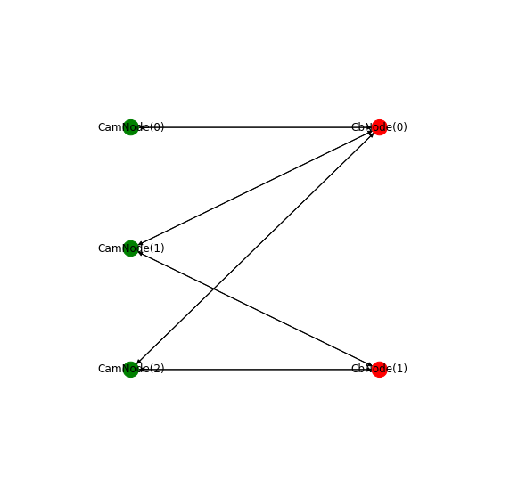

# camera_calib_python

This is a python based camera calibration "library". Some things:

* Uses [nbdev](https://github.com/fastai/nbdev), which is an awesome and fun way to develop and tinker.
* Uses pytorch for optimization of intrinsic and extrinsic parameters. Each step in the model is modularized as its own pytorch `nn.module` in the `modules.ipynb` notebook. 
    * Optimization is carried out via the built in `LBFGS` optimizer. The `LBFGS` optimizer uses only the gradient to do a quasi second order optimization. However, I've noticed it's imperfect and can a take long time to converge in some cases.
    * The use of pytorch allows the forward pass to be easily modified. It also allows the use of any differentiable loss function although I've noticed that sum of squared errors seems to give the best results of the losses I've tried.
* The fiducial point detector for my calibration board uses a pytorch neural net under the hood (more info [here](https://github.com/justinblaber/fiducial_detect)), which is easily integrated into this library since its python based.

# Tutorial


```python
import camera_calib.api as api
```

Before calibration can be done, we need the following information:

1. Images and their respective camera and pose indices
2. Calibration board geometry
3. Fiducial point detector
4. Control point refiner

### 1) Images


```python
import re
from pathlib import Path
```


```python
files_img = list(Path('data/dot_vision_checker').glob('*.png'))
files_img
```


    [PosixPath('data/dot_vision_checker/SERIAL_16276941_DATETIME_2019-06-07-00:38:48-109732_CAM_2_FRAMEID_0_COUNTER_2.png'),
     PosixPath('data/dot_vision_checker/SERIAL_19061245_DATETIME_2019-06-07-00:38:19-438594_CAM_1_FRAMEID_0_COUNTER_1.png'),
     PosixPath('data/dot_vision_checker/SERIAL_16276942_DATETIME_2019-06-07-00:38:19-438636_CAM_3_FRAMEID_0_COUNTER_1.png'),
     PosixPath('data/dot_vision_checker/SERIAL_16276942_DATETIME_2019-06-07-00:38:48-109736_CAM_3_FRAMEID_0_COUNTER_2.png'),
     PosixPath('data/dot_vision_checker/SERIAL_16276941_DATETIME_2019-06-07-00:38:19-438631_CAM_2_FRAMEID_0_COUNTER_1.png')]


```python
def _parse_name(name_img):
    match = re.match(r'''SERIAL_(?P<serial>.*)_
                         DATETIME_(?P<date>.*)_
                         CAM_(?P<cam>.*)_
                         FRAMEID_(?P<frameid>.*)_
                         COUNTER_(?P<counter>.*).png''', 
                     name_img, 
                     re.VERBOSE)
    return match.groupdict()
```


```python
imgs = []
for file_img in files_img:
    dict_group = _parse_name(file_img.name)
    img = api.File16bitImg(file_img)
    img.idx_cam = int(dict_group['cam'])-1
    img.idx_cb  = int(dict_group['counter'])-1
    imgs.append(img)
```


```python
for img in imgs: print(f'{img.name} - cam: {img.idx_cam} - cb: {img.idx_cb}')
```

    SERIAL_16276941_DATETIME_2019-06-07-00:38:48-109732_CAM_2_FRAMEID_0_COUNTER_2 - cam: 1 - cb: 1
    SERIAL_19061245_DATETIME_2019-06-07-00:38:19-438594_CAM_1_FRAMEID_0_COUNTER_1 - cam: 0 - cb: 0
    SERIAL_16276942_DATETIME_2019-06-07-00:38:19-438636_CAM_3_FRAMEID_0_COUNTER_1 - cam: 2 - cb: 0
    SERIAL_16276942_DATETIME_2019-06-07-00:38:48-109736_CAM_3_FRAMEID_0_COUNTER_2 - cam: 2 - cb: 1
    SERIAL_16276941_DATETIME_2019-06-07-00:38:19-438631_CAM_2_FRAMEID_0_COUNTER_1 - cam: 1 - cb: 0


### 2) Calibration board geometry

1) The first thing to do is define a calibration board geometry. This specifies where fiducial markers and control points are located. For this example, my dot vision checker board is used.


```python
h_cb = 50.8
w_cb = 50.8
h_f = 42.672
w_f = 42.672
num_c_h = 16
num_c_w = 16
spacing_c = 2.032
cb_geom = api.CbGeom(h_cb, w_cb,
                     api.CpCSRGrid(num_c_h, num_c_w, spacing_c),
                     api.FmCFPGrid(h_f, w_f))
```


```python
cb_geom.plot()
```


### 3) Fiducial detector


```python
from pathlib import Path
```

This fiducial detector will take in an image and return the locations of the fiducial markers. The detector in this example is a neural net trained specifically on my calibration board. More info available at:

* https://github.com/justinblaber/fiducial_detect


```python
file_model = Path('models/dot_vision_checker.pth')
detector = api.DotVisionCheckerDLDetector(file_model)
```

### 4) Control Point Refiner

The refiner will take in an image, initial guesses for control points, and the boundaries around the control points. These boundaries help determine how much neighboring info can be used to refine the control point.


```python
refiner = api.OpenCVCheckerRefiner(hw_min=5, hw_max=15, cutoff_it=20, cutoff_norm=1e-3)
```

## Calibrate

Now, we can calibrate


```python
calib = api.multi_calib(imgs, cb_geom, detector, refiner)
```

    Refining control points for: SERIAL_19061245_DATETIME_2019-06-07-00:38:19-438594_CAM_1_FRAMEID_0_COUNTER_1...
    Refining single parameters...
     - Iteration: 000 - Norm:    0.00492 - Loss:    5.36733
     - Iteration: 001 - Norm:    0.14985 - Loss:    3.73449
     - Iteration: 002 - Norm:    0.01378 - Loss:    3.72178
     - Iteration: 003 - Norm:    3.80677 - Loss:    3.50140
     - Iteration: 004 - Norm:   60.91136 - Loss:    1.69839
     - Iteration: 005 - Norm:    0.00000 - Loss:    1.69839
    Refining control points for: SERIAL_16276941_DATETIME_2019-06-07-00:38:48-109732_CAM_2_FRAMEID_0_COUNTER_2...
    Refining control points for: SERIAL_16276941_DATETIME_2019-06-07-00:38:19-438631_CAM_2_FRAMEID_0_COUNTER_1...
    Refining single parameters...
     - Iteration: 000 - Norm:    0.04150 - Loss:  145.18373
     - Iteration: 001 - Norm:    0.13431 - Loss:   83.63355
     - Iteration: 002 - Norm:    0.84358 - Loss:    3.92886
     - Iteration: 003 - Norm:    0.27788 - Loss:    3.59249
     - Iteration: 004 - Norm:   27.32690 - Loss:    2.63209
     - Iteration: 005 - Norm:    0.01235 - Loss:    2.63208
     - Iteration: 006 - Norm:    0.00000 - Loss:    2.63208
    Refining control points for: SERIAL_16276942_DATETIME_2019-06-07-00:38:19-438636_CAM_3_FRAMEID_0_COUNTER_1...
    Refining control points for: SERIAL_16276942_DATETIME_2019-06-07-00:38:48-109736_CAM_3_FRAMEID_0_COUNTER_2...
    Refining single parameters...
     - Iteration: 000 - Norm:    0.04606 - Loss:   59.69785
     - Iteration: 001 - Norm:    0.18309 - Loss:   23.21653
     - Iteration: 002 - Norm:    0.19523 - Loss:   10.38509
     - Iteration: 003 - Norm:    0.09765 - Loss:   10.04688
     - Iteration: 004 - Norm:    1.24148 - Loss:    9.89971
     - Iteration: 005 - Norm:  104.59143 - Loss:    1.76128
     - Iteration: 006 - Norm:    0.30163 - Loss:    1.76086
     - Iteration: 007 - Norm:    0.00000 - Loss:    1.76086
    Refining multi parameters...
     - Iteration: 000 - Norm:    0.00057 - Loss:   10.14000
     - Iteration: 001 - Norm:    0.00077 - Loss:    8.43798
     - Iteration: 002 - Norm:    0.00093 - Loss:    8.04861
     - Iteration: 003 - Norm:    0.00119 - Loss:    7.83276
     - Iteration: 004 - Norm:    0.00315 - Loss:    7.58489
     - Iteration: 005 - Norm:    0.00316 - Loss:    7.44066
     - Iteration: 006 - Norm:    0.00535 - Loss:    7.29554
     - Iteration: 007 - Norm:    0.00113 - Loss:    7.28451
     - Iteration: 008 - Norm:    0.00057 - Loss:    7.28226
     - Iteration: 009 - Norm:    0.00415 - Loss:    7.26387
     - Iteration: 010 - Norm:    0.00782 - Loss:    7.23045
     - Iteration: 011 - Norm:    0.00450 - Loss:    7.21851
     - Iteration: 012 - Norm:    0.00355 - Loss:    7.20743
     - Iteration: 013 - Norm:    0.00730 - Loss:    7.19441
     - Iteration: 014 - Norm:    0.02037 - Loss:    7.17015
     - Iteration: 015 - Norm:    0.00110 - Loss:    7.16913
     - Iteration: 016 - Norm:    0.01844 - Loss:    7.15090
     - Iteration: 017 - Norm:    0.00002 - Loss:    7.15090
     - Iteration: 018 - Norm:    0.00000 - Loss:    7.15090


From Bo Li's calibration paper, we know the coordinate graph of poses and cameras forms a bipartite graph. For debugging purposes this is displayed below.


```python
api.plot_bipartite(calib)
```





Plot residuals


```python
api.plot_residuals(calib);
```


Plot extrinsics; note that `%matplotlib notebook` can be used to make the plot interactive


```python
import matplotlib.pyplot as plt
```


```python
fig = plt.figure(figsize=(20,20))

ax = fig.add_subplot(2, 2, 1, projection='3d')
api.plot_extrinsics(calib, ax=ax)
ax.view_init(elev=90, azim=-90)

ax = fig.add_subplot(2, 2, 2, projection='3d')
api.plot_extrinsics(calib, ax=ax)
ax.view_init(elev=45, azim=-45)

ax = fig.add_subplot(2, 2, 3, projection='3d')
api.plot_extrinsics(calib, ax=ax)
ax.view_init(elev=0, azim=-90)

ax = fig.add_subplot(2, 2, 4, projection='3d')
api.plot_extrinsics(calib, ax=ax)
ax.view_init(elev=0, azim=0)

plt.subplots_adjust(wspace=0, hspace=0)
```


This matches pretty closely to my camera rig

## Save/Load

Save


```python
api.save(calib, '/tmp/calib.pth')
```

Load


```python
del calib
```


```python
calib = api.load('/tmp/calib.pth')
```

# Build


```python
from camera_calib.utils import convert_notebook
```


```python
convert_notebook()
```
